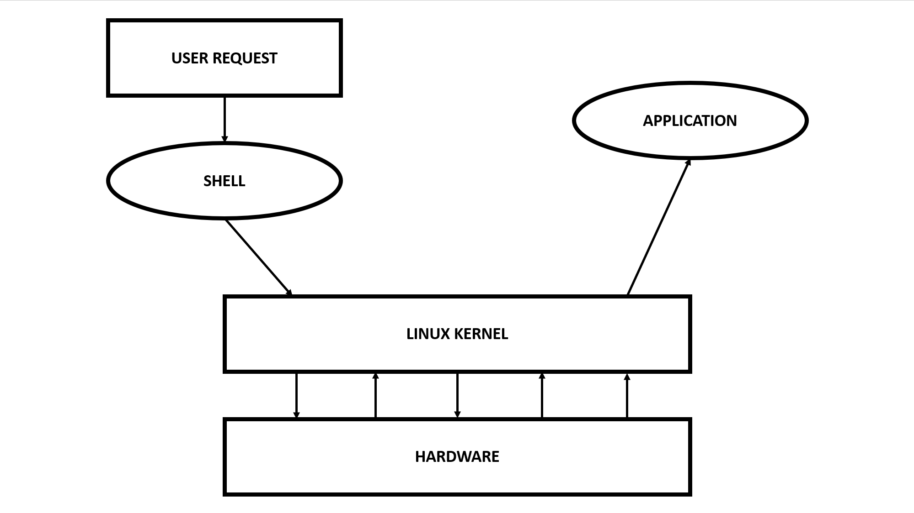

# What is Linux Kernel?

> [WHAT IS LINUX](001_What_is_Linux.md) --- [HOME](../README.md) --- [WHAT IS LINUX SHELL](003_What_is_Linux_Shell.md)

Linux kernel is the *heart of Linux Operating System.*

Kernel manages:
* File Management
* Multi-tasking
* Memory Management
* Input/Output Management
* Process Management
* Device Management
* Networking

