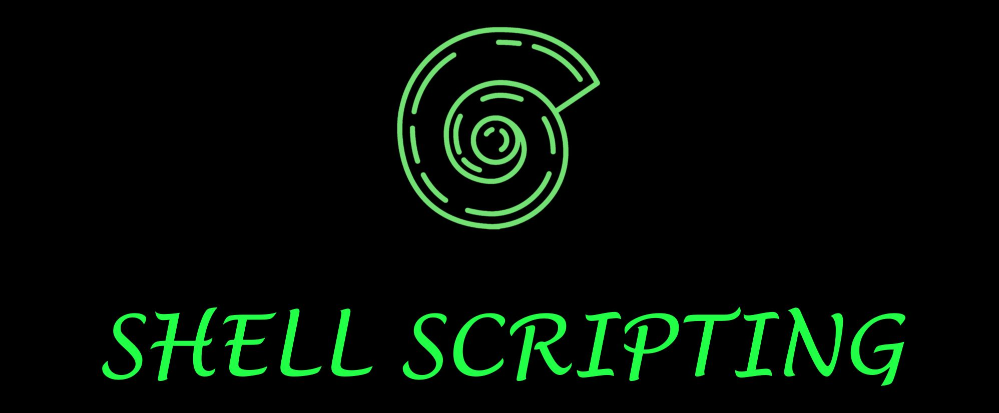

# Shell Scripting

The documentation is written by [Kshitiz Saini](https://www.linkedin.com/in/kshitizsaini113/), and is copyrighted under [GNU General Public Licensce v3](LICENSE).

1. [Quick Introduction - LINUX](000_Quick_Introduction/001_What_is_Linux.md)


### Implementation tree

**All the information is present in README.md file of the specific folders.**

**The contribution guidelines are present in [CONTRIBUTING.md](CONTRIBUTING.md) file.**
```
Data Structure and Algorithms
|
├── 000_Quick_Introduction
|   ├── 001_What_is_Linux.md
|   ├── 002_What_is_Linux_Kernel.md
|   ├── 003_What_is_Linux_Shell.md
|   ├── 004_Shell_prompt.md
|   ├── 005_Command_Line.md
|   ├── 006_BASH_Shell.md
|   ├── 007_Unix_Philosophy.md
|   ├── 008_What_is_Shell_Script.md
│   └── 009_Why_Shell_Script.md
│
├── CONTRIBUTING.md           
|
├── LICENSE
│
├── README.md  
│
└── shell.jpg                          
```